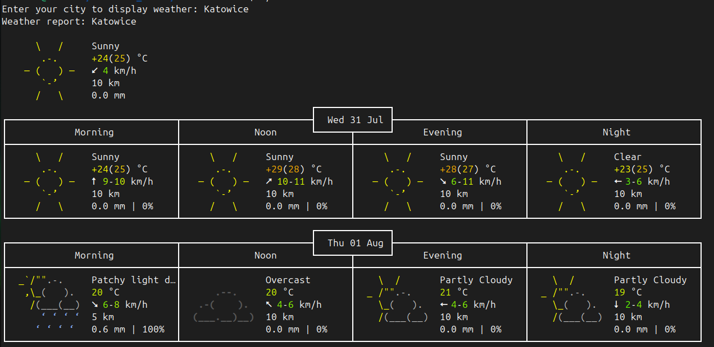

# Linux Weather Task

## Description
This repository contains my first Linux task for displaying weather in ASCII format.

## Example Output
Enter the city name to display the weather:

## Features
- Display current weather.
- Daily weather forecast.
- ASCII format display.

## Requirements
- Linux system
- Bash

## Repository Structure
- `README.md`: Main file with project information
- `bash-output.png`: Example of script output
- `weather.sh`: Script for displaying the weather

## License
This project is licensed under the MIT License. See the LICENSE file for details.

